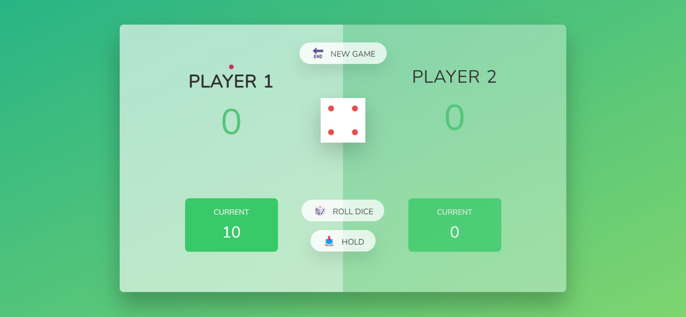
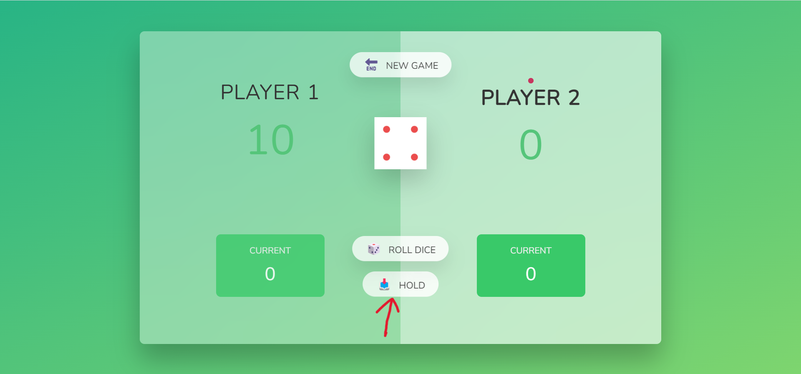
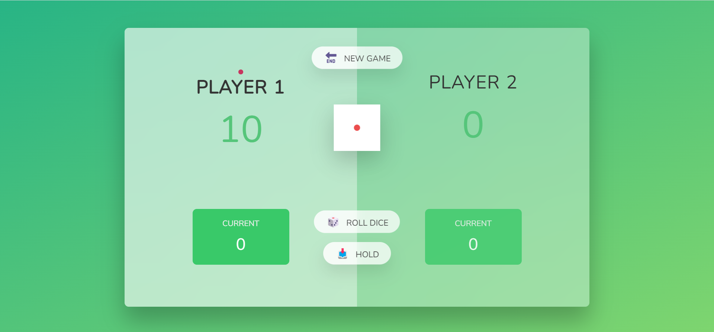

## website link
click [here](https://diceplay-two.vercel.app/) to see the Live preview of the website

## How To Play
There are two players in this game - **_player1_**, and **_palyer2_**. Both player will starts from **_0_** score. **_Player1_** will starts the game always. There is a **_red small circle_** to focus the active player.

>The player who will pass the 100 score first will won the match.

There are two buttons, one is **_ROLL DICE_** and another is **_HOLD_**. If you click on **_ROLL DICE_** a dice number will appear(between 1 to 6) then you have two options, either you can  click on **_ROLL DICE_** again or click on **_HOLD_** button. If you click on **_ROLL DICE_** your dice number will add to your previous number. Suppose you click on **_ROLL DICE_** and you got **6** and again click on **_ROLL DICE_** and got **4**. So, the total score will be **10**. Now if you hold the score **10** will be added to your current score and Player 2 will be active.

>Note: There are two ways that switches players. One is if someone clcks on **_HOLD_** button and another is if someone clicks on **_ROLL DICE_** and got **1**. There is one thing to be notted that if someone got **1** score he will lose his current turn score. For example, one player has 15 marks and he got his turn again and got **4** and **6** by clcking the **_ROLL DICE_**.Then again he clicks on **_ROLL DICE_** and got **0**, now his current **10** marks will not add to previous **15** marks.

**_Player1_** has score **10** an now  it's **_player2_** turn. **_player2_** score **5** and **1**. So the score of **_player2_** will be **0** and turn will shift to **_player1_**

